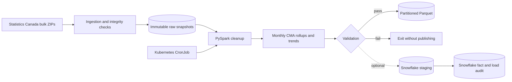

# Canadian housing supply pipeline

This repo builds a monthly housing-supply dataset for Canadian census
metropolitan areas (CMAs). It combines CMHC housing starts, completions and
units under construction with intended-market detail and Statistics Canada
price and permit indicators.

The output grain is one row per month, CMA and dwelling type. Along with the
source measures, it includes rolling averages, year-over-year change and a
simple anomaly flag based on the preceding 12 months.

## Current status

The development profile has been run locally, in Docker and as a Job on a local
`kind` cluster. It covers Calgary, Toronto and Vancouver from January 2024 to
December 2025.

```text
360 rows
24 months
3 CMAs
5 dwelling types
45 columns
15 anomaly flags
```

The three downloaded source cubes contain 1,208,140 published datapoints. They
are aggregate statistical series, not individual homes or transactions. After
the development filters and source-specific cleanup, 3,096 observations feed
the 360-row analytics table.

Snowflake loading is implemented and covered by mocked tests, but has not been
run against a real account.

## Data flow



The repository name predates the final design. Since the Spark job transforms
the data before it reaches Snowflake, this is closer to ETL than strict ELT.

## Sources

| Table | Used for |
| --- | --- |
| [34-10-0154-01](https://www150.statcan.gc.ca/t1/tbl1/en/tv.action?pid=3410015401), sourced from CMHC | Starts, completions and units under construction |
| [34-10-0148-01](https://www150.statcan.gc.ca/t1/tbl1/en/tv.action?pid=3410014801), sourced from CMHC | Starts by intended market |
| [34-10-0292-01](https://www150.statcan.gc.ca/t1/tbl1/en/tv.action?pid=3410029201) | Residential building permits (full profile only) |
| [18-10-0205-01](https://www150.statcan.gc.ca/t1/tbl1/en/tv.action?pid=1810020501) | New Housing Price Index |

The pipeline uses Statistics Canada's bulk distribution for all four tables.
This gives each source a stable product ID, machine-readable metadata and a
consistent ZIP/CSV format. See [DATASET.md](DATASET.md) for the time windows,
licensing and modeling boundaries.

## Run locally

Requirements:

- Python 3.11
- Java 17 or newer
- [`uv`](https://docs.astral.sh/uv/)

Install the locked environment:

```bash
UV_CACHE_DIR=.uv-cache UV_PYTHON_INSTALL_DIR=.python uv sync --locked
```

Run the development pipeline, including ingestion:

```bash
uv run housing-elt run --profile development
```

Once the raw snapshots are present, the same job can run offline:

```bash
uv run housing-elt run --profile development --skip-ingestion
```

A successful run ends with a summary similar to this:

```text
validation=passed analytics_rows=360 years=2 anomalies=15 \
activity_only_rows=0 market_only_rows=0 missing_price_rows=0 \
missing_permit_rows=360 output=data/curated/housing_monthly
```

The permits source is left out of the development profile because its ZIP is
about 365 MB. Missing permit values are therefore expected in this run. The
full profile downloads it and keeps all eligible CMAs in the 2016–2025
benchmark window (2018–2025 for permits).

Useful stage-specific commands:

```bash
uv run housing-elt show-config
uv run housing-elt ingest --profile development
uv run housing-elt clean --profile development
uv run housing-elt aggregate --profile development
```

More setup notes are in [DEVELOPMENT.md](DEVELOPMENT.md).

## What happens during a run

### Ingestion

Each source is downloaded in its original ZIP format. The downloader checks
the WDS response, host and product ID, byte count, ZIP members, CRC and SHA-256
before publishing a snapshot. Completed snapshots are stored by release time
and checksum, so a corrected upstream release does not overwrite the previous
one. Rerunning ingestion revalidates matching local files and reports
`already_present`.

### Spark transformations

Raw fields are read as strings under an explicit schema, then normalized into
separate clean facts. This preserves status codes and distinguishes a genuine
zero from an unavailable or suppressed value. Newer releases win when the same
natural key appears more than once.

The analytics step pivots the two CMHC tables, joins them on month/CMA/dwelling
type and adds CMA-level price and permit context. Published totals stay separate
from component dwelling types to avoid double counting.

The Parquet output is partitioned by year:

```text
data/curated/housing_monthly/
├── reference_year=2024/
└── reference_year=2025/
```

Year partitions are a better fit than month partitions here: the table is
small, and monthly partitions would create many tiny files.

### Validation

The job checks schema, row-count bounds, key nulls, duplicate keys, dwelling
coverage and source reconciliations. In the verified development run:

- all 360 intended-market totals matched the activity starts values;
- all 216 eligible total-versus-component comparisons matched;
- there were no duplicate keys, key nulls or incomplete CMA/month groups; and
- price coverage was complete for the selected cities and months.

Validation runs before either Parquet or Snowflake publication. A failed check
returns a non-zero process exit.

The detailed field rules live in [TRANSFORMATION_CONTRACT.md](TRANSFORMATION_CONTRACT.md),
[ANALYTICS_CONTRACT.md](ANALYTICS_CONTRACT.md) and
[VALIDATION_CONTRACT.md](VALIDATION_CONTRACT.md).

## Docker

```bash
docker build --tag canadian-housing-elt:local .

docker run --rm \
  --mount type=bind,source="$PWD/data/raw",target=/app/data/raw,readonly \
  --mount type=bind,source="$PWD/data/interim",target=/app/data/interim \
  --mount type=bind,source="$PWD/data/curated",target=/app/data/curated \
  canadian-housing-elt:local \
  run --profile development --skip-ingestion
```

The image uses Python 3.11 slim, a Java runtime and `tini`. It runs as UID/GID
10001 and contains no data or credentials. This is a single-node Spark job; it
does not try to package a Spark cluster. See [CONTAINER.md](CONTAINER.md) for
the failure smoke test and Linux bind-mount notes.

## Kubernetes

The local target is `kind`. After installing the checksummed project-local
tools described in [KUBERNETES.md](KUBERNETES.md):

```bash
.tools/kind create cluster --config k8s/kind-cluster.yaml
.tools/kind load docker-image canadian-housing-elt:local --name housing-elt
.tools/kubectl apply -k k8s
.tools/kubectl -n housing-elt create job \
  --from=cronjob/housing-elt-monthly housing-elt-smoke
.tools/kubectl -n housing-elt wait \
  --for=condition=complete job/housing-elt-smoke --timeout=20m
.tools/kubectl -n housing-elt logs job/housing-elt-smoke
```

The CronJob runs at 11:00 UTC on the fifth of each month. It prevents overlap,
sets CPU/memory limits, caps retries and runtime, and runs with a read-only root
filesystem and no service-account token. Local outputs use `emptyDir`, so they
are disposable.

## Snowflake

The loader uses `snowflake-connector-python` and streams the validated Spark
rows in bounded batches. It writes to batch-addressed staging, reconciles the
staged count and keys, then replaces the batch's month range in one transaction.
An audit table records started, successful and failed loads.

The modeled table is only tens of thousands of rows at the planned full scope,
so the Python connector keeps the dependency surface smaller than the
Spark–Snowflake connector. There is no clustering key; that would add cost
without a measured need at this size.

The DDL is in [sql/001_create_housing_analytics.sql](sql/001_create_housing_analytics.sql),
and the publication statements are in
[sql/002_publish_housing_monthly.sql](sql/002_publish_housing_monthly.sql).
Live setup and required environment variables are covered in
[SNOWFLAKE_LOADER.md](SNOWFLAKE_LOADER.md). Using a real warehouse is optional
and may incur Snowflake charges.

## Tests

```bash
uv lock --check
uv run ruff check .
uv run ruff format --check .
uv run pytest -q
```

The current suite has 58 tests. HTTP and Snowflake are mocked; Spark tests use a
local JVM. There are also static checks for the Docker and Kubernetes security
contracts.

## Troubleshooting

- `JAVA_GATEWAY_EXITED`: check that Java 17+ is available and localhost socket
  binding is allowed.
- No raw snapshot found: run `uv run housing-elt ingest --profile development`
  first.
- `ErrImageNeverPull` in kind: load the local image with
  `.tools/kind load docker-image canadian-housing-elt:local --name housing-elt`.
- Bind-mount permission errors on Linux: make the writable data directories
  accessible to UID/GID 10001.
- A validation count changes after a new source release: keep the new raw
  snapshot, inspect the failed metric and review the contract before changing
  its threshold.

## Limits

- Only the development profile has been run end to end with real source files.
- The Snowflake boundary is mock-tested but not live-tested.
- Spark runs in local mode, including inside Docker and Kubernetes.
- The local CronJob expects raw data to be mounted and writes ephemeral output.
- The z-score is a screening rule, not a forecast or a claim that a source value
  is wrong.

At larger scale I would move raw and curated data to versioned object storage,
use bulk Snowflake loading, add centralized run metrics and alerts, and run
Spark on managed infrastructure or the Spark Operator.

## Repository layout

```text
config/             source registry and validation thresholds
data/               local raw, intermediate and curated data (Git-ignored)
k8s/                kind and CronJob manifests
sql/                Snowflake DDL and publication SQL
src/housing_elt/    pipeline package
tests/              unit and deployment-contract tests
```
