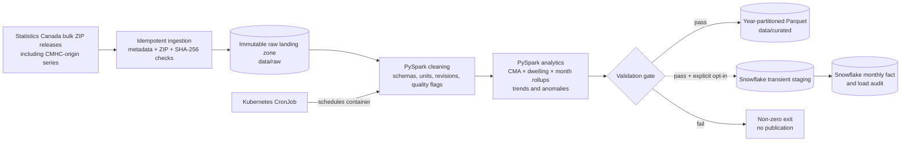

# Canadian Housing Supply Batch Pipeline

A reproducible batch data pipeline that turns official monthly Canadian housing
tables into an analytics-ready fact at:

> **reference month × census metropolitan area (CMA) × dwelling type**

The project demonstrates immutable ingestion, testable PySpark transformations,
fail-closed data quality, an idempotent Snowflake publication design, a lean
single-node Spark container, and scheduled execution on local Kubernetes.

The source tables are pre-aggregated statistical series—not individual permits,
buildings, or households. The honest scale story is therefore integration of
multiple years, geographies, releases, and analytical dimensions rather than a
claim of processing millions of row-level events.

## What it answers

The modeled fact supports questions such as:

- How do starts, completions, and month-end units under construction trend by
  CMA and dwelling type?
- How does the intended-market mix—rental, homeowner, condominium,
  co-operative, and other—differ across cities and time?
- Where do starts move unusually relative to that CMA and dwelling type's
  preceding 12 months?
- When available, how do building-permit values and new-housing price indexes
  provide context for supply activity?

Trend and anomaly fields are descriptive screening signals. They do not imply
causality or identify bad source data by themselves.

## Architecture



The repository name uses “ELT,” but the implemented warehouse boundary is more
precisely **ETL**: Spark transforms the raw source tables before loading the
modeled fact into Snowflake. Inside Snowflake, validated staging rows are then
transactionally published into the serving table. Calling out that distinction
is more defensible than stretching the terminology in an interview.

## Data sources

| Role | Official table | Project use |
| --- | --- | --- |
| Housing activity | [Statistics Canada 34-10-0154-01](https://www150.statcan.gc.ca/t1/tbl1/en/tv.action?pid=3410015401), sourced from CMHC | Monthly starts, completions, and under-construction counts |
| Intended market | [Statistics Canada 34-10-0148-01](https://www150.statcan.gc.ca/t1/tbl1/en/tv.action?pid=3410014801), sourced from CMHC | Starts by homeowner, rental, condominium, co-operative, and other market |
| Building permits | [Statistics Canada 34-10-0292-01](https://www150.statcan.gc.ca/t1/tbl1/en/tv.action?pid=3410029201) | Leading supply context in the full profile |
| New housing prices | [Statistics Canada 18-10-0205-01](https://www150.statcan.gc.ca/t1/tbl1/en/tv.action?pid=1810020501) | CMA-level price-index context |

The fixed benchmark window is 2016–2025, except the current permits table,
which begins in 2018. The fast development slice uses Calgary, Toronto, and
Vancouver for January 2024 through December 2025. See [DATASET.md](DATASET.md)
for source selection, coverage, attribution, licensing, and scope boundaries.

## Verified development result

The repeatable development run produces:

```text
validation=passed analytics_rows=360 years=2 anomalies=15 \
activity_only_rows=0 market_only_rows=0 missing_price_rows=0 \
missing_permit_rows=360 output=data/curated/housing_monthly
```

The 360 rows reconcile to 24 months × 3 CMAs × 5 canonical dwelling types.
Permit coverage is intentionally absent from this profile because its roughly
365 MB compressed source archive is reserved for an explicit full-profile run.

The local Kubernetes smoke Job completed from the same image in 18 seconds. A
second test Job intentionally required 361 rows and exited `1` before
publication, demonstrating that the validation gate fails closed.

## Quick start

### Prerequisites

- Python 3.11
- [`uv`](https://docs.astral.sh/uv/) 0.12 or a compatible later 0.x version
- Java 17 or newer for local PySpark
- Docker Desktop for container and `kind` workflows

No global Python packages are required. From the repository root:

```bash
UV_CACHE_DIR=.uv-cache UV_PYTHON_INSTALL_DIR=.python uv sync --locked
uv run housing-elt show-config
```

Download, validate, transform, and publish the development data locally:

```bash
uv run housing-elt run --profile development
```

Once immutable raw snapshots exist, repeat the Spark portion without network
access:

```bash
uv run housing-elt run --profile development --skip-ingestion
```

Generated Parquet files appear under year partitions:

```text
data/curated/housing_monthly/
├── reference_year=2024/
└── reference_year=2025/
```

The source registry is [config/sources.toml](config/sources.toml), and versioned
quality thresholds are in [config/validation.toml](config/validation.toml).
Detailed local setup and individual stage commands are in
[DEVELOPMENT.md](DEVELOPMENT.md).

### Run the checks

```bash
uv lock --check
uv run ruff check .
uv run ruff format --check .
uv run pytest -q
```

Unit tests mock external HTTP and Snowflake boundaries. Spark transformation
tests use a local JVM; no test suite command contacts a paid service.

## Container run

Build the pinned, non-root image:

```bash
docker build --tag canadian-housing-elt:local .
```

Run it against existing raw snapshots:

```bash
docker run --rm \
  --mount type=bind,source="$PWD/data/raw",target=/app/data/raw,readonly \
  --mount type=bind,source="$PWD/data/interim",target=/app/data/interim \
  --mount type=bind,source="$PWD/data/curated",target=/app/data/curated \
  canadian-housing-elt:local \
  run --profile development --skip-ingestion
```

The container runs one local Spark driver with two worker threads rather than
pretending to be a multi-node Spark cluster. See [CONTAINER.md](CONTAINER.md)
for the base-image decision, image inspection, native-Linux ownership notes,
and the intentional validation-failure command.

## Kubernetes run

The local orchestration target is `kind`: its nodes are Docker containers, so
the image can be loaded without a registry or cloud cluster. After following
the checksummed project-local tool setup in [KUBERNETES.md](KUBERNETES.md):

```bash
.tools/kind create cluster --config k8s/kind-cluster.yaml
.tools/kind load docker-image canadian-housing-elt:local --name housing-elt
.tools/kubectl apply -k k8s
.tools/kubectl -n housing-elt create job \
  --from=cronjob/housing-elt-monthly housing-elt-smoke
.tools/kubectl -n housing-elt wait \
  --for=condition=complete job/housing-elt-smoke --timeout=20m
.tools/kubectl -n housing-elt logs job/housing-elt-smoke
```

The CronJob runs at 11:00 UTC on the fifth day of each month. It forbids
overlap, bounds retries/runtime/history, drops Linux capabilities, uses a
read-only root filesystem, and mounts raw input read-only. Its intermediate
and curated paths are deliberately ephemeral `emptyDir` volumes for this local
demonstration.

## Snowflake publication

Snowflake is optional and disabled by default. No live account, warehouse, or
other billable resource was used while building or verifying this repository.

The pipeline uses `snowflake-connector-python` because Spark reduces the source
cubes to a compact serving fact. Bounded `executemany()` batches avoid adding a
Spark connector, JDBC driver, and Scala compatibility surface solely for tens
of thousands of modeled rows. For a materially larger output, staged Parquet
with `PUT`/`COPY INTO` or a compatible Spark–Snowflake connector should be
benchmarked instead.

Publication is designed as:

1. insert a `STARTED` audit record;
2. stream validated rows into batch-addressed transient staging;
3. reconcile staged count and natural-key uniqueness;
4. transactionally replace the staged reference-month window in the final
   table; and
5. commit a `SUCCEEDED` audit record, or roll back and record `FAILED`.

The DDL is [sql/001_create_housing_analytics.sql](sql/001_create_housing_analytics.sql)
and the exact publish transaction is
[sql/002_publish_housing_monthly.sql](sql/002_publish_housing_monthly.sql).
Read [SNOWFLAKE_DESIGN.md](SNOWFLAKE_DESIGN.md) and
[SNOWFLAKE_LOADER.md](SNOWFLAKE_LOADER.md) before explicitly enabling
`--load-snowflake`. Never place credentials in the repository or the example
Kubernetes Secret.

## Key engineering decisions

| Decision | Rationale |
| --- | --- |
| Keep native ZIP releases immutable | Preserves replayable source evidence and avoids lossy early conversion. |
| Address snapshots by release and SHA-256 | Makes reruns idempotent while retaining publisher revisions as separate artifacts. |
| Use explicit source-specific Spark schemas | Detects source drift and preserves coded missing/suppressed values. |
| Separate cleaning, aggregation, validation, and loading | Keeps business rules unit-testable and prevents a monolithic job. |
| Full-join the two core CMHC rollups | Retains one-sided coverage problems instead of hiding them with an inner join. |
| Partition Parquet by year | Preserves useful date pruning without creating tiny monthly files at this fact grain. |
| Exclude the current month from anomaly baselines | Prevents look-ahead leakage in the prior-12-month z-score. |
| Validate before both local and Snowflake publication | Bad data returns a non-zero exit and cannot reach either output path. |
| Omit a Snowflake clustering key | The fact is far below the scale where paid automatic clustering is justified; measure pruning first. |
| Use a Kubernetes CronJob, not a Spark cluster | Demonstrates scheduled batch operations while keeping compute proportional to the workload. |

Field-level semantics are documented in
[TRANSFORMATION_CONTRACT.md](TRANSFORMATION_CONTRACT.md),
[ANALYTICS_CONTRACT.md](ANALYTICS_CONTRACT.md), and
[VALIDATION_CONTRACT.md](VALIDATION_CONTRACT.md).

## Data-quality controls

Before anything is published, the pipeline checks:

- exact schema and required-column presence;
- profile-specific row-count bounds;
- natural-key uniqueness at month × CMA × dwelling type;
- null thresholds for core and optional measures;
- the expected five dwelling types per CMA/month;
- reconciliation between published housing totals and their components; and
- coverage mismatches between housing activity and intended-market facts.

Failure messages contain the check name, observed value, and expected bound.
The writer and optional Snowflake callback are unreachable when validation
raises.

## Repository map

```text
config/                 Versioned source and validation contracts
data/raw/               Immutable downloaded ZIP snapshots (Git-ignored)
data/interim/           Reproducible extracted/clean working data (Git-ignored)
data/curated/           Year-partitioned Parquet output (Git-ignored)
k8s/                    kind, Kustomize, CronJob, and failure-smoke manifests
sql/                    Reviewed Snowflake DDL and transactional DML
src/housing_elt/        Installable ingestion, Spark, validation, and loader code
tests/unit/             Offline unit and contract tests
```

See [PROJECT_STRUCTURE.md](PROJECT_STRUCTURE.md) for path ownership and runtime
configuration.

## Troubleshooting

| Symptom | Check |
| --- | --- |
| `JAVA_GATEWAY_EXITED` | Confirm Java 17+ is available and localhost socket binding is permitted. |
| No raw snapshot found | Run `uv run housing-elt ingest --profile development`; do not manufacture CSV fixtures in `data/raw`. |
| Row-count or reconciliation failure after a new release | Preserve the raw revision, inspect the named metric, and review the versioned contract before changing a threshold. |
| Container cannot write on native Linux | Give UID/GID `10001` write access to the mounted interim and curated directories. |
| kind reports `ErrImageNeverPull` | Run `.tools/kind load docker-image canadian-housing-elt:local --name housing-elt`. |
| Kubernetes Job output disappears | Local curated output uses `emptyDir`; inspect logs or replace it with approved persistent/object storage for production. |
| Snowflake configuration error | Supply every documented `HOUSING_ELT_SNOWFLAKE_*` variable and confirm the DDL has been reviewed and applied to the intended environment. |

## Known limitations and production evolution

- The verified development profile excludes the large building-permits source;
  the full benchmark needs additional local bandwidth, disk, and runtime.
- Statistics Canada bulk tables are complete, revisable snapshots. The pipeline
  selects one explicit snapshot per source instead of unioning overlapping
  full-history releases and double-counting observations.
- Spark runs locally inside one process/container. At substantially larger
  scale, use object storage and a managed or operator-backed Spark runtime,
  then tune partitions from measured shuffle and file-size metrics.
- The local CronJob assumes raw data is already mounted and uses ephemeral
  outputs. A production schedule should ingest into versioned object storage,
  promote outputs atomically, and retain run metadata externally.
- The z-score rule is intentionally transparent but basic. Production anomaly
  detection would evaluate seasonality, structural breaks, and backtested alert
  quality.
- Snowflake behavior is covered by mocked boundary tests, but live integration
  remains an explicit cost/credential gate. A bounded test should reconcile
  staged and final counts before claiming production verification.
- Production hardening would add CI, image vulnerability/signature checks,
  centralized logs and metrics, alerting, an external secrets manager, and
  retention/lifecycle policies.

## Defensible portfolio claims

This project demonstrates local PySpark DataFrame and window-function work,
multi-source dimensional modeling, immutable/idempotent ingestion, explicit
lineage, fail-closed quality gates, transactional warehouse-loading logic,
container security, and Kubernetes batch scheduling.

It does **not** claim streaming, a distributed production Spark cluster,
millions of source events, causal inference, or a live production Snowflake
deployment. Those boundaries are intentional and documented so the project can
be explained accurately in a technical interview.

